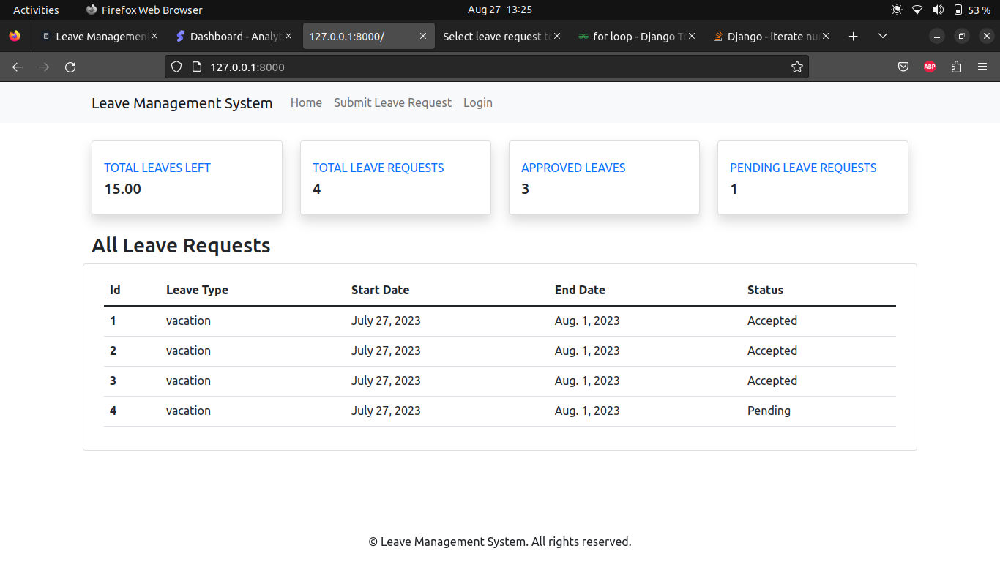
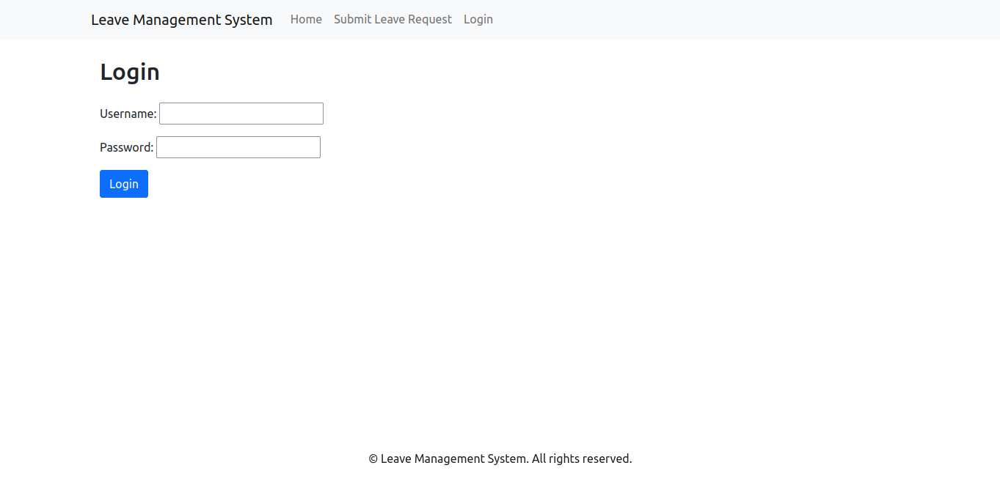
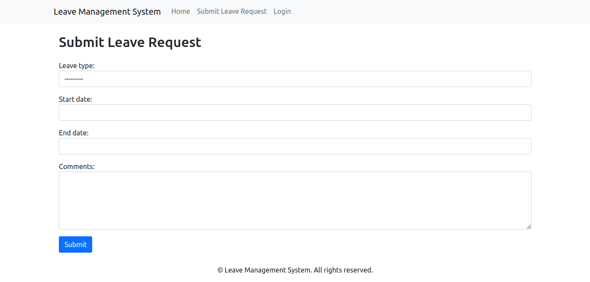

# Leave Management project E-Governance
## Steps to run the project
1. Install python version greater than 3.9
2. Make an virtual environment and activate it
3. Install all the dependencies using the command 
    ```
    pip install -r requirements.txt
    ```
4. Then run the project using 
    ```
   python manage.py runserver
   ```
* Note default username and password 
    ```
    username: suman
    password: admin
    ```
## HomePage



## Login Page



## Leave Request Form
